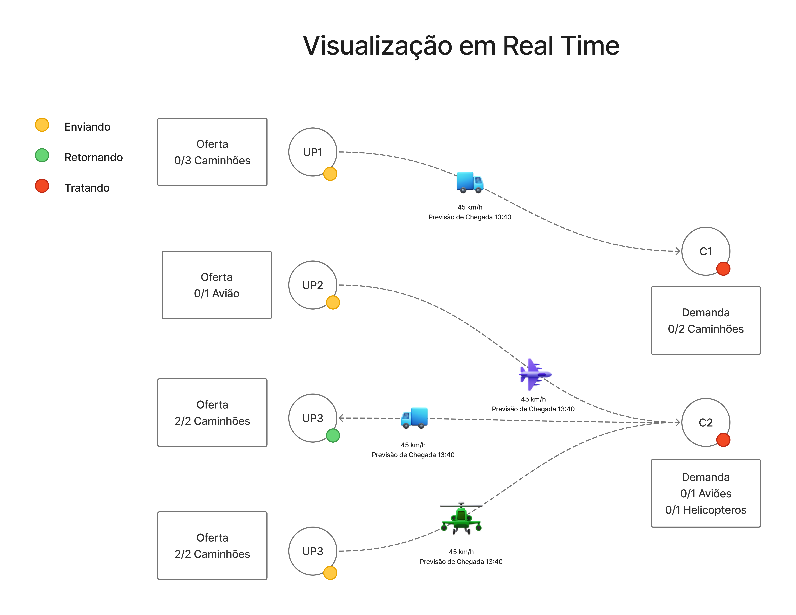
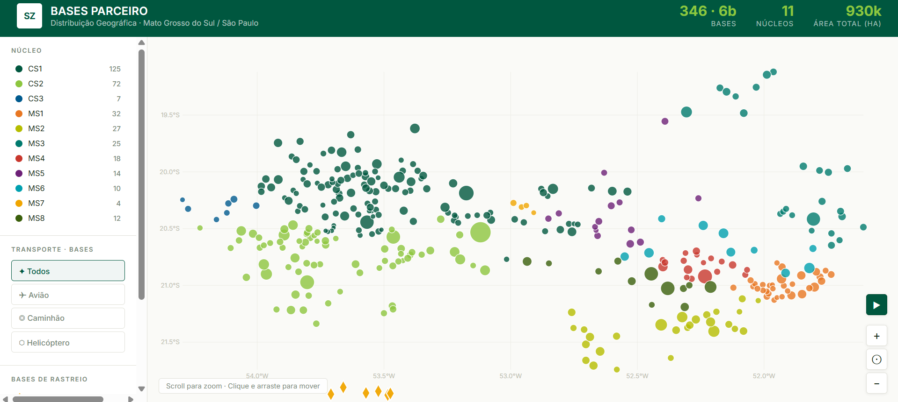
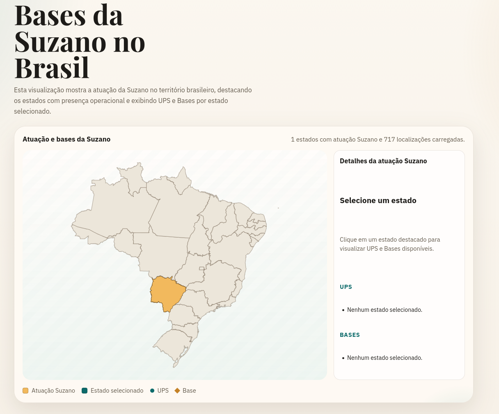
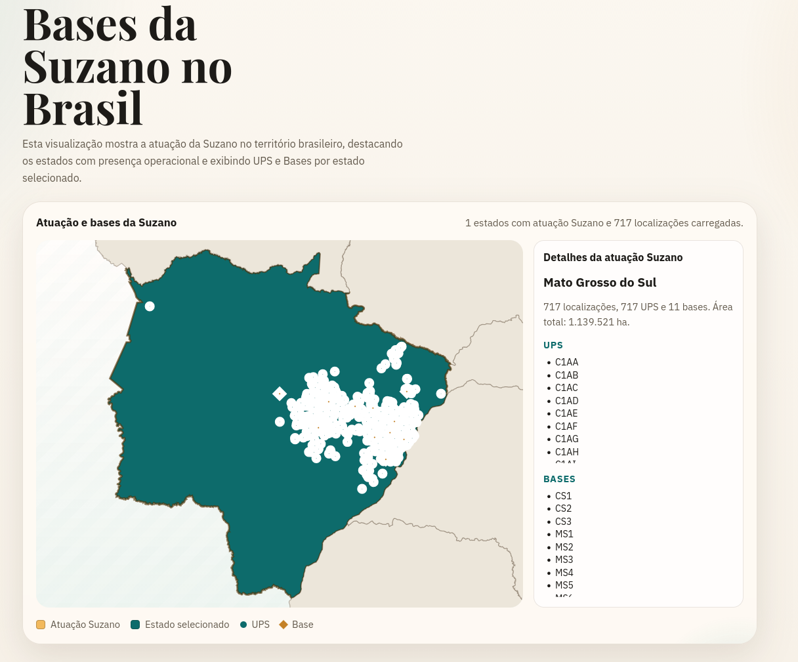
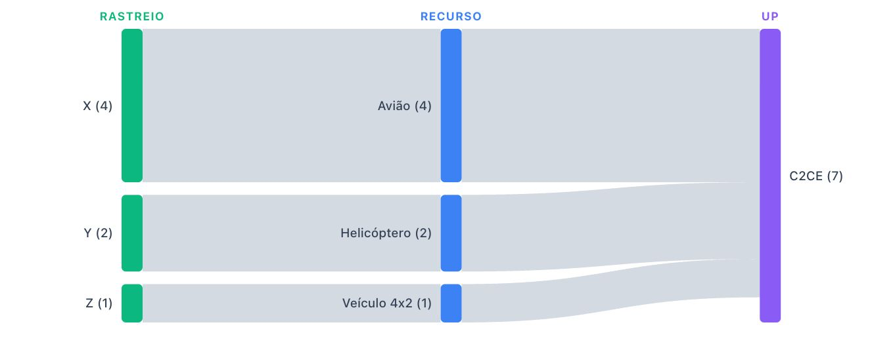
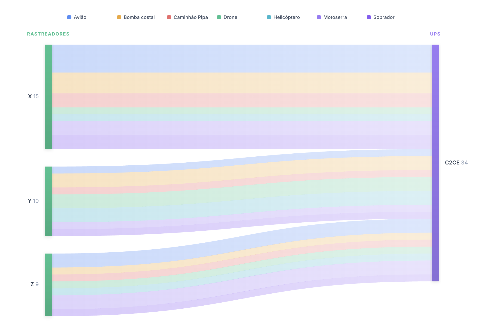
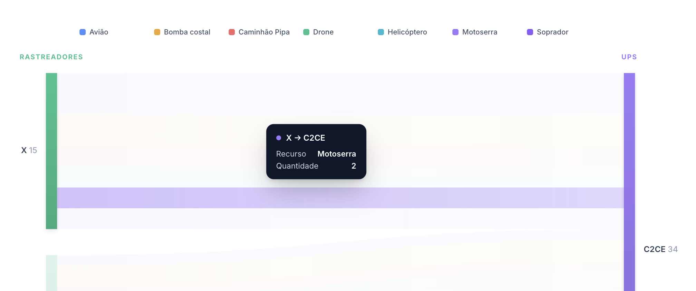

# Sistema de Otimização de Resposta a Incêndios Florestais - Suzano

## Sumário

- [Sistema de Otimização de Resposta a Incêndios Florestais - Suzano](#sistema-de-otimização-de-resposta-a-incêndios-florestais---suzano)
  - [Sumário](#sumário)
  - [Contexto do Projeto](#contexto-do-projeto)
  - [Organização das Duplas](#organização-das-duplas)
  - [Visualizações e Gráficos](#visualizações-e-gráficos)
    - [1. Mapa de Calor dos Focos de Incêndio](#1-mapa-de-calor-dos-focos-de-incêndio)
      - [Relevância](#relevância)
      - [Explicação Técnica](#explicação-técnica)
    - [2. Grafo Bipartido de Alocação de Recursos](#2-grafo-bipartido-de-alocação-de-recursos)
      - [Relevância](#relevância-1)
      - [Explicação Técnica](#explicação-técnica-1)
    - [3. Mapa de Infraestrutura Operacional](#3-mapa-de-infraestrutura-operacional)
      - [Relevância](#relevância-2)
      - [Explicação Técnica](#explicação-técnica-2)
      - [Implementação Atual da Dupla 3 (Rebeca e Marcos)](#implementação-atual-da-dupla-3-rebeca-e-marcos)
      - [Como Executar a Visualização da Dupla 3](#como-executar-a-visualização-da-dupla-3)
    - [4. Diagrama Sankey de Distribuição de Recursos](#4-diagrama-sankey-de-distribuição-de-recursos)
      - [Relevância](#relevância-3)
      - [Evolução da Visualização](#evolução-da-visualização)
  - [Como Executar](#como-executar)

## Contexto do Projeto

O projeto desenvolve um **sistema de apoio à decisão para otimização da resposta a incêndios florestais** na Suzano S.A., líder global na produção de celulose de eucalipto. A solução utiliza algoritmos de grafos e modelagem matemática para recomendar, em tempo real, qual base operacional acionar e quais recursos mobilizar (aeronaves, recursos terrestres e brigadistas) para cada ocorrência de incêndio.

O sistema foi concebido para atender duas personas principais:

- **Márcia Viana** (Operadora do Centro de Operações Integradas): precisa de recomendações objetivas e rápidas sob alta pressão para decidir qual base acionar e quais recursos enviar.
- **Gerson Neves** (Gestor Corporativo de Inteligência Patrimonial): demanda padronização, justificativas técnicas auditáveis e rastreabilidade das decisões para governança corporativa.

A solução combina eficiência operacional com compromissos de sustentabilidade ambiental (ODS da ONU), reduzindo o tempo de resposta, minimizando áreas queimadas e otimizando o uso de recursos críticos.

## Organização das Duplas

Cada dupla é responsável pelo desenvolvimento de uma visualização específica que compõe o sistema integrado de apoio à decisão:

| Dupla       | Integrantes                             | Visualização                | Responsabilidade                                     |
| ----------- | --------------------------------------- | --------------------------- | ---------------------------------------------------- |
| **Dupla 1** | Caroline Paz e Christian Santos         | Mapa de Calor dos Focos     | Análise espacial de risco e densidade de ocorrências |
| **Dupla 2** | Pedro Soares e Breno Silva              | Grafo Bipartido de Recursos | Modelagem de alocação entre centrais e UPs           |
| **Dupla 3** | Rebeca Sbroglio e Marcos Silva          | Mapa de Infraestrutura      | Visão operacional de bases, UPs e rastreadores       |
| **Dupla 4** | Gabriel Bartmanovicz e Leonardo Fischel | Diagrama Sankey             | Fluxo de distribuição de recursos                    |

Todas as visualizações foram desenvolvidas em **D3.js** e são integradas ao sistema de recomendação baseado em algoritmos de grafos.

## Visualizações e Gráficos

### 1. Mapa de Calor dos Focos de Incêndio

**Dupla responsável:** Caroline e Christian

#### Relevância

O **Mapa de Calor dos Focos de Incêndio** é uma ferramenta essencial para **análise geoespacial** e **gestão de risco ambiental**. Ele permite transformar grandes volumes de registros históricos de incêndios em uma visualização intuitiva, facilitando a identificação de **padrões e tendências ao longo do território monitorado**.

Ao consolidar os dados em uma representação visual baseada em intensidade, o mapa possibilita identificar rapidamente **regiões com maior concentração de ocorrências**, conhecidas como _hotspots_. Essas áreas representam locais com maior probabilidade de novos eventos, seja por fatores **ambientais, climáticos ou operacionais**.

Essa visualização contribui diretamente para diferentes níveis de **tomada de decisão**:

- **Monitoramento operacional:** identificação de áreas que demandam vigilância mais frequente
- **Planejamento preventivo:** definição estratégica do posicionamento de brigadas e equipamentos
- **Gestão de recursos:** priorização de investimentos em infraestrutura de combate e monitoramento
- **Análise histórica:** compreensão de padrões sazonais relacionados a clima, seca e atividades humanas

Além disso, ao cruzar os dados de incêndio com informações de **UPs (Unidades de Produção)**, **fazendas**, **áreas operacionais** e **núcleos**, o sistema permite compreender como os focos se distribuem dentro da área de atuação da empresa, auxiliando no **planejamento de ações preventivas** e **respostas rápidas**.

#### Explicação Técnica

A implementação do mapa de calor utiliza **técnicas modernas de visualização de dados geoespaciais**, integrando diferentes camadas de informação em uma única **interface interativa**.

O sistema é construído a partir de **três componentes principais**.

**1. Base Cartográfica**

O mapa utiliza uma **base geográfica real das regiões onde a Suzano opera**, representada através de arquivos cartográficos (**GeoJSON** ou **TopoJSON**). Esses arquivos contêm os **limites territoriais** que permitem posicionar corretamente os dados sobre o mapa.

A renderização é feita utilizando a biblioteca **D3.js**, especificamente o módulo **D3-geo**, que projeta **coordenadas geográficas (latitude e longitude)** para o sistema de coordenadas da tela.

**2. Integração de Dados Operacionais**

O sistema utiliza **dois conjuntos principais de dados**.

**Arquivo de UPs**

Contém informações estruturais das unidades operacionais:

- UP
- Fazenda
- Área
- Núcleo
- Latitude
- Longitude

Esse arquivo define os **pontos geográficos fixos** onde os recursos operacionais estão localizados.

**Arquivo de Incêndios**

Contém os registros históricos de ocorrências:

- UP
- Data de Registro

A partir desses dados, o sistema realiza automaticamente o cálculo de:

- Quantidade de ocorrências por UP
- Frequência de incêndios ao longo do tempo
- Distribuição espacial dos focos

Esses cálculos são processados dinamicamente no navegador utilizando **JavaScript** e **D3**.

#### 3. Geração do Heatmap

Após o processamento dos dados, o sistema gera uma **camada de calor (_heatmap_)** sobre o mapa.

Cada ponto associado a uma **UP** recebe um **peso proporcional ao número de ocorrências registradas**. A intensidade visual é então representada por um **gradiente de cores**, onde:

- **Cores claras (amarelo)** → baixa concentração de ocorrências
- **Cores intermediárias (laranja)** → concentração moderada
- **Cores quentes (vermelho)** → alta concentração de focos

Esse tipo de visualização permite representar rapidamente a **densidade espacial dos eventos**, transformando dados complexos em uma leitura visual simples. Em mapas de calor, regiões com maior intensidade de dados aparecem com **cores mais fortes**, facilitando a identificação de **áreas críticas**.

#### Benefícios para o Sistema

A utilização de um mapa de calor traz diversos benefícios para o sistema de monitoramento:

- Redução do tempo de análise de dados
- Identificação visual imediata de áreas críticas
- Melhoria no planejamento logístico das brigadas
- Base para modelos preditivos de risco de incêndio


### 2. Grafo Bipartido de Alocação de Recursos

**Dupla responsável:** Pedro Jorge e Breno

#### Relevância

O grafo bipartido é fundamental para **projetar a alocação de recursos em tempo real**, simulando o atendimento a ocorrências de forma geográfica. Ele permite:

- **Visualizar o uso de geo3D e coordenadas reais** extraídas do arquivo CSV para precisão territorial exata das UPs (Unidades de Produção).
- **Propor o tamanho visual das áreas** utilizando um Bubble Chart, onde o raio de cada círculo é diretamente proporcional à quantidade de hectares (área) da respectiva UP.
- **Acompanhar uma simulação em tempo real** de um acionamento, oferecendo indicativos claros de origem, tipo do recurso despachado (aviões, helicópteros, caminhões) e previsão de chegada (ETA).

Esta visualização é essencial para **Gerson Neves** (gestor) validar a cobertura técnica do projeto e para **Márcia Viana** (operadora) entender rapidamente quais bases estão disponíveis, como elas se movem na geografia real e quais os tempos hábeis de resposta.

#### Explicação Técnica

A visualização do HTML foca estritamente na representatividade front-end orientada a dados, e é construída utilizando o D3.js. Ela inclui as seguintes implementações:

- **Escalas Dinâmicas e Proporções**:
  - `xScale` e `yScale` para mapear automaticamente os eixos `lon` e `lat` num canvas SVG dinâmico.
  - O raio das bolhas (`rScale`) mapeado matematicamente sob um `d3.scaleSqrt()` baseado na área de cada reserva afetada (hectares).
- **Simulação Interativa**: Uma rotina nativa de timeout (`d3.timer`) dispara animações em tempo real (marching ants e progresso geográfico) conectando centros operacionais ('Bases de Rastreio') com hotspots simulados sob um raio em movimento.
- **Diferenciação Estilística no Canvas**: Cores temáticas da Suzano, tooltips detalhados disparados reativamente sobre as bolhas flutuantes, e controles de Zoom base (`d3.zoom`) orientados aos eixos do cenário de distribuição no Mato Grosso do Sul.

#### Imagens da Visualização

**Primeira Visualização (Rascunho)**


Ideia inicial de representação de como poderia ser demonstrado, exibindo as capacidades e as demandas no estilo de grafo, para simplificar a visualização.

**Visualização em HTML/D3.js**

Visualização robusta, poscionando via csv do parceiro as UPs e instanciando via um csv auxiliar as bases de rastreio para simulações já implementadas no algoritmo e para visualizar no mapa/grafo atual.


### 3. Mapa de Infraestrutura Operacional

**Dupla responsável:** Rebeca e Marcos

#### Relevância

Este mapa fornece uma **visão operacional em tempo real** da infraestrutura de combate a incêndios, essencial para:

- **Planejamento de cobertura territorial**: identificar gaps e áreas descobertas
- **Análise de redundância**: avaliar se há bases suficientes para atendimento simultâneo
- **Gestão de ativos críticos**: rastrear localização de caminhões-pipa, torres de monitoramento e equipamentos
- **Integração com rastreadores**: monitorar posicionamento dinâmico de equipes e veículos

Para a operadora **Márcia**, este mapa oferece contexto geográfico para suas decisões. Para o gestor **Gerson**, permite avaliar se a distribuição de bases está alinhada com a exposição ao risco.

#### Explicação Técnica

O mapa integra três camadas de informação:

1. **Bases operacionais**: marcadores georreferenciados com capacidade de cada central
2. **Unidades de Produção (UPs)**: polígonos representando áreas florestais com classificação de risco
3. **Rastreadores ativos**: posições em tempo real de equipes e veículos (quando disponível via API)

A visualização utiliza:

- **D3-geo** para projeções cartográficas
- **GeoJSON** para representação de polígonos de UPs
- **Interatividade**: tooltips ao passar o mouse, filtros por região/tipo de recurso

#### Implementação Atual da Dupla 3 (Rebeca e Marcos)

A implementação atual da Dupla 3 amplia a proposta do mapa de infraestrutura operacional, com foco em análise territorial da atuação da Suzano por estado e inspeção de detalhes operacionais.

Os principais elementos da solução são:

- **Identificação automática dos estados com atuação**, por meio do cruzamento entre a base geográfica (GeoJSON) e o conjunto de localizações operacionais (CSV).
- **Seleção interativa por estado**, com atualização do contexto analítico e aplicação de foco geográfico (zoom automático).
- **Painel de síntese operacional**, consolidando total de localizações, quantidade de UPS, quantidade de bases e área agregada.
- **Representação visual diferenciada de ativos**, com UPS em marcadores circulares e bases em marcadores losangulares.
- **Navegação espacial avançada** (zoom e panning), preservando o tamanho visual dos marcadores para manter legibilidade em diferentes escalas.

As capturas abaixo ilustram o comportamento da visualização:

**Visão inicial (sem estado selecionado):**



**Visão com estado selecionado (foco + marcadores):**



#### Como Executar a Visualização da Dupla 3

Para executar a visualização da Dupla 3, utilize um servidor local simples a partir do diretório `mapa`:

```bash
cd mapa
npx serve .
```

A seguir, abra no navegador o endereço exibido no terminal (tipicamente `http://localhost:3000`).

Caso seja necessário fixar a porta de execução:

```bash
cd mapa
npx serve -l 5123 .
```

Nesse caso, acesse `http://localhost:5123`.

### 4. Diagrama Sankey de Distribuição de Recursos

**Dupla responsável:** Gabriel e Leonardo

#### Relevância

O diagrama Sankey é uma ferramenta poderosa para visualizar fluxos de recursos ao longo de múltiplas etapas, permitindo:

- **Rastrear a jornada dos recursos** desde os rastreadores até as UPs afetadas
- **Comunicar complexidade logística** de forma intuitiva
- **Auditar decisões** de mobilização em análises pós-ocorrência

Para **Gerson** (gestor), o Sankey oferece uma narrativa visual clara para apresentações à diretoria. Para **Márcia** (operadora), apresenta as decisões do algoritmo de forma mais intuitiva.

#### Evolução da Visualização

**Sankey Antigo (Versão Inicial):**



**Sankey Novo (Versão Refinada):**



Com as recentes melhorias e ajustes no cenário, a visualização evoluiu para representar um contexto mais direto e realista da operação de combate a incêndios. Foram aplicadas as seguintes melhorias na nova versão estrutural:

- **Simplificação da Estrutura (De 3 para 2 camadas):** A versão anterior possuía 3 colunas (Rastreador → Recurso → UP), onde os recursos atuavam como nós intermediários. Na nova versão, adotou-se uma estrutura mais concisa com apenas 2 colunas principais (Rastreadores → UPs).
- **Recursos Representados por Fluxos:** O tipo de recurso (Avião, Bomba Costal, Caminhão Pipa, Drone, Helicóptero, Motoserra, Soprador) agora é representado pela **cor dos próprios fluxos (links)** de conexão. Uma nova legenda clara foi adicionada para facilitar a identificação visual rápida de cada mobilização.
- **Interatividade Aprimorada e Tooltips:** Foram implementados efeitos de _hover_ dinâmicos nos nós e vínculos. Ao posicionar o mouse sobre um elemento, o restante ganha opacidade e a seleção é realçada, enquanto um **tooltip detalhado** aparece automaticamente listando a origem, destino, tipo de recurso mobilizado e sua quantidade correspondente exata.

**SankeyNovo com Tooltips e Hover:**



## Como Executar

Para visualizar os mapas e gráficos desenvolvidos, navegue até o arquivo html correspondente de cada dupla e abra-o em um navegador web moderno.

Para facilitar, instale a biblioteca **Live Server** (disponível como extensão para VS Code) e execute o comando "Live Server: Open with Live Server" no arquivo `html` de cada visualização. Isso garantirá que as dependências do D3.js sejam carregadas corretamente e permitirá interatividade total com os gráficos.
